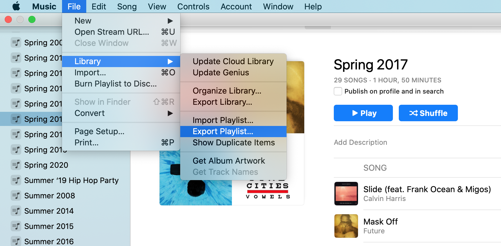

# Iðunn 🍏

Convert exported Apple Music playlists to YAML.

## Why?

I love making playlists. Every year, every season, I make a playlist. That music becomes my soundtrack for that time in my life, and once it's gone, gives me a way for me to bring back a bygone moment.

I want a way to take snapshots of my playlists -- as text files, naturally, so they can be tracked in source control!

## Installation

`idunn` depends on Python 3.6 or greater.

```sh
git clone https://github.com/brcrista/idunn.git
# Recommended: create and activate a venv first
pip install idunn/
```

## How?

Apple Music provides a [way to export playlists](https://support.apple.com/guide/music/save-a-copy-of-your-playlists-mus27cd5060f/mac), either in TSV or XML.



These formats aren't human-readable. They do have an advantage in that you can use them to import the data back into Apple Music, so might want to keep them handy after you're done.

Export as a text file (which is actually in TSV format). Then run:


```sh
python3 -m idunn "My Playlist.txt"
```

This will produce a file named `My Playlist.yml`:

```yml
name: My Playlist
songs:
- name: Float On
  artist: Magic Mouse
  album: Good News for People Who Love Bad News
- name: Looking for America
  artist: Lana Del Rey
  album: Looking for America - Single
# etc.
```

### Batch processing

You can use a script like this to process a bunch of playlists at once. (You have to export them individually, though.)

```sh
#!/usr/bin/env bash
set -e

source ../idunn-venv/bin/activate

for x in *.txt
do
    [[ -e "$x" ]] || break
    python3 -m idunn "$x"
done

deactivate
```
